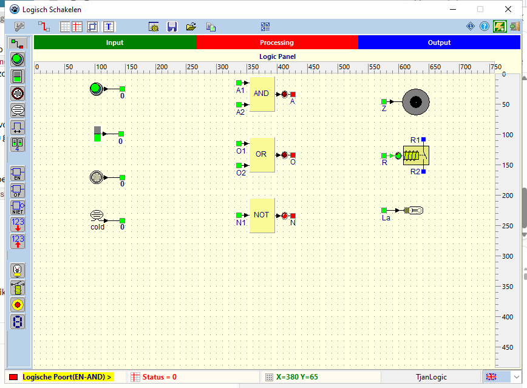

# Logic

Simulator voor digitale schakelingen, gemaakt met Lazarus / Free Pascal.
Je bouwt een schakeling op een paneel met schakelaars, sensoren, logische
poorten, tellers, geheugens, lampen en displays, en verbindt ze met draden.
Daarna zet je de simulatie aan en zie je de schakeling werken.

*English summary: see [below](#english).*



## Downloaden

Kant-en-klare versies staan bij de
[Releases](https://github.com/willem750-win/Logical/releases).
Voor Windows: pak `Logic-<versie>-win64.zip` uit naar een map naar keuze en
start `logicCEF.exe`. Installeren is niet nodig.
Voor Linux: pak `Logic-<versie>-linux-x86_64.tar.gz` uit in je thuismap en
start `./logicCEF`.

## Onderdelen

| Groep      | Onderdelen |
|------------|------------|
| Invoer     | drukknop, schakelaar, dipschakelaar (0–15), impulsgenerator, lichtsensor, warmtesensor |
| Verwerking | EN-poort, OF-poort, NIET-poort, tellerblok, geheugenblok |
| Uitvoer    | lamp, relais, zoemer, 7-segmentdisplay |

Het 7-segmentdisplay toont 0–F als het aan de display-uitgang van een teller of
geheugen hangt, en 1 of 0 als het aan een gewone uitgang hangt (drukknop,
schakelaar, poort ...).

Verder:

- raster, linialen, richtlijnen, kader en titel op het paneel;
- meerdere onderdelen tegelijk selecteren en verplaatsen, met hun draden;
- kant-en-klare oefenpanelen (beslissen, teller, geheugen) in `Resultaat/panels`;
- gebruikersinterface en help in het **Nederlands, Engels, Frans en Duits**;
- werkt onder **Windows** en **Linux** (GTK2).

## Inhoud van de repository

| Map / bestand | Wat |
|---------------|-----|
| `jwlogic.lpk` | Lazarus-pakket met de simulatiecomponenten (palet **JWLOGIC**), o.a. `janSimLogic.pas` |
| `projects/LogicCEF/` | Het programma, voor Windows en Linux. Onder Windows opent de help in een ingebouwde browser (CEF), onder Linux in de standaardbrowser |
| `projects/LogicCEF/helpsrc/` | Bronbestanden van de help (nl/en/fr/de) en `make-help.ps1` |
| `projects/LogicCEF/Resultaat/` | Uitvoermap: hier komt het programma. In de repo staan alleen `panels`, `ini`, `html`, `ImmoSetup` en `help-oud` |
## Bouwen

Nodig: [Lazarus](https://www.lazarus-ide.org/) 4.x met Free Pascal 3.2.2 of nieuwer.

```
git clone https://github.com/willem750-win/Logical.git
```

1. Open en installeer `jwlogic.lpk` in Lazarus (*Package → Open Package File*,
   daarna *Use → Install*). Het pakket heeft ook `rx` en `ComboBox_image` nodig.
2. Open het project `projects/LogicCEF/logic.lpi` (Windows en Linux).

   Installeer de pakketten die Lazarus als ontbrekend meldt.
   Voor LogicCEF hoort daar **CEF4Delphi** bij.
3. Bouw het project. Het programma komt in `projects/LogicCEF/Resultaat/`.

### CEF-bestanden (Windows)

De CEF-runtime staat niet in de repo (te groot). Kopieer de CEF-binaries
die bij je CEF4Delphi-versie horen (`libcef.dll`, `chrome_elf.dll`,
`icudtl.dat`, de `.pak`- en `.bin`-bestanden en de map `locales`) naar
`projects/LogicCEF/Resultaat/`.

### Help opbouwen

De help in `Resultaat/help` wordt gemaakt uit `helpsrc`:

```
powershell -ExecutionPolicy Bypass -File projects\LogicCEF\helpsrc\make-help.ps1
```

Onder Linux kan dat ook, met PowerShell (`pwsh`):

```
pwsh -File projects/LogicCEF/helpsrc/make-help.ps1
```

### Release maken

- Windows: `projects\LogicCEF\make-release.ps1 -Version 1.0.0` maakt
  `Logic-1.0.0-win64.zip` (programma, CEF-runtime, help en data).
- Linux: `sh projects/LogicCEF/make-linux-release.sh 1.0.0` maakt
  `Logic-1.0.0-linux-x86_64.tar.gz`; met `--upload` gaat het pakket
  meteen naar de GitHub-release `v1.0.0`.

## Met dank aan

De `jan*`-componenten (`janSimLogic`, `janLed`, `janToggle`, `janSimIndicator`,
`janSimPID`, `janSimPIDLinker`) zijn gebaseerd op de freeware-componenten
van **Jan Verhoeven**. Ze zijn omgezet naar Lazarus en sterk uitgebreid
(teller, geheugen, display, panelen, meertaligheid, Linux ...).

## Licentie

MIT, zie [LICENSE](LICENSE). Uitzondering: `SZCodeBaseX.pas` (Sasa Zeman)
valt onder de Mozilla Public License 1.1, zoals in dat bestand vermeld.

---

## English

**Logic** is a digital circuit simulator written in Lazarus / Free Pascal.
Place switches, sensors, logic gates (AND, OR, NOT), counters, memories, lamps,
relays, buzzers and 7-segment displays on a panel, connect them with
wires and run the simulation. User interface and help are available in Dutch,
English, French and German. It runs on Windows and Linux (GTK2).

Download: see [Releases](https://github.com/willem750-win/Logical/releases) (Windows: unzip and run `logicCEF.exe`; Linux: extract the `.tar.gz` and run `./logicCEF`).

To build: install `jwlogic.lpk` in Lazarus 4.x, then open
`projects/LogicCEF/logic.lpi` (Windows and Linux; needs CEF4Delphi, and on Windows
the matching CEF binaries copied into `projects/LogicCEF/Resultaat/`).
Generate the help with `projects/LogicCEF/helpsrc/make-help.ps1`.

The `jan*` components are based on the freeware components by Jan Verhoeven,
ported to Lazarus and extended.

License: MIT, see [LICENSE](LICENSE), except `SZCodeBaseX.pas` (MPL 1.1).
